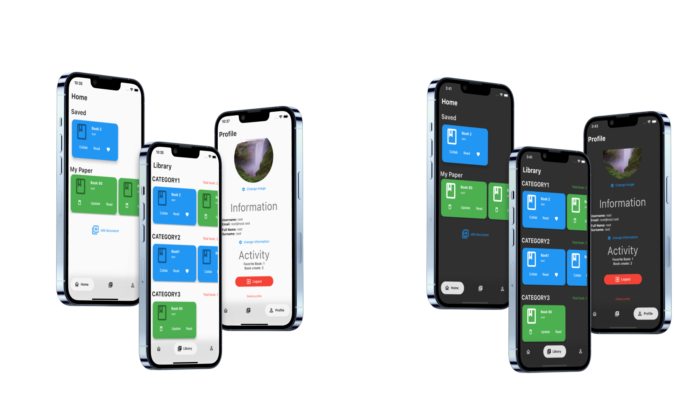
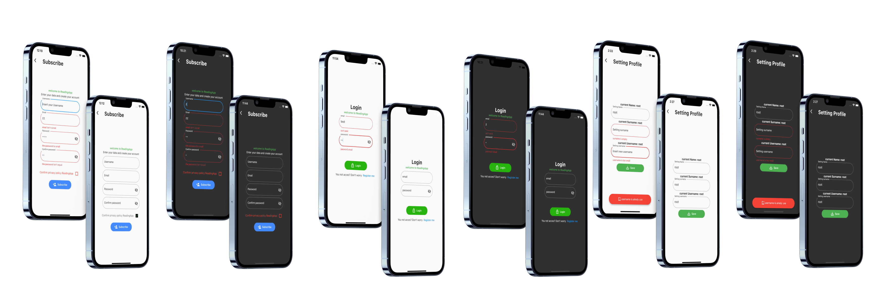
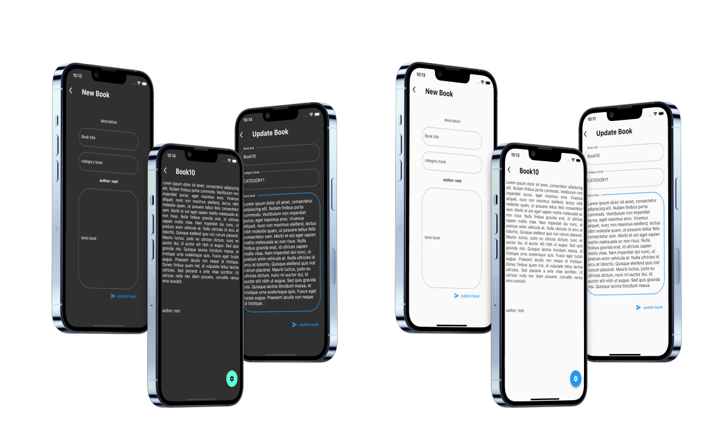

# Reading App
Undergraduate project for the course Web and Mobile Application Design.

# Objective

Create an app (Ios/ Android) that can help and/or share text documents. The app will implement the functions necessary to upload a text file and to connect the user with the author of the text. Communication with the author will be via email. For more information go to [wiki](https://github.com/BrachettaMatteo/reading_app/wiki).

# Getting Started

>For security reasons, data is not shared to access Firebase services. So for correct operation create the Secure.dart file with the data for firebase communication and create the Firestone cloud as described in the [wiki](https://github.com/BrachettaMatteo/reading_app/wiki).

### Clone repository

``` bash
git clone https://github.com/BrachettaMatteo/readingApp
``` 

### Gets all the dependencies listed in the pubspec.yaml file

``` bash
flutter pub get
``` 

### Run project 

``` bash
flutter run  
```
# Apparence

### main screen
<figure>
  
</figure>

### service screen
<figure>
  
</figure>

### features screen
<figure>
  
</figure>
